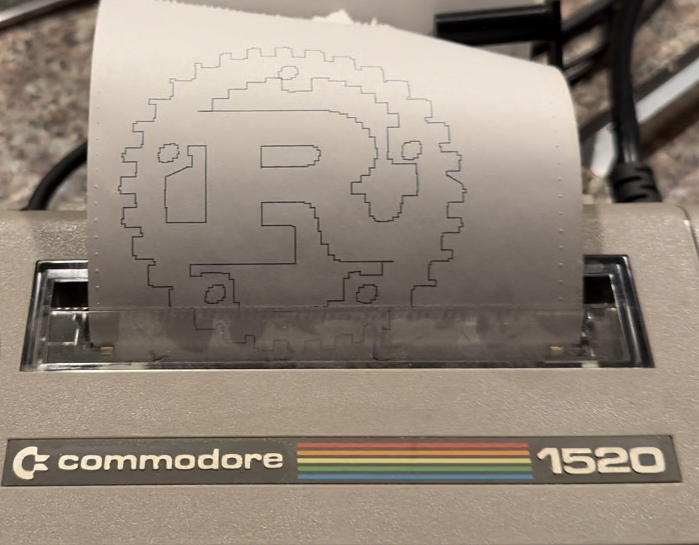

# Commodore 1520 SVG Plotter
Quick project that can take an SVG and plot it on the Commodore 1520 colour plotter. Supports
any adapter compatible with the OpenCBM project, which must be installed on your system for
this project to compile. 

